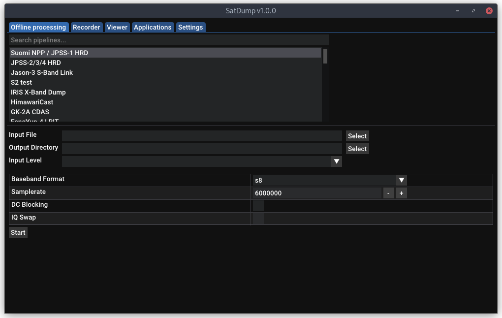
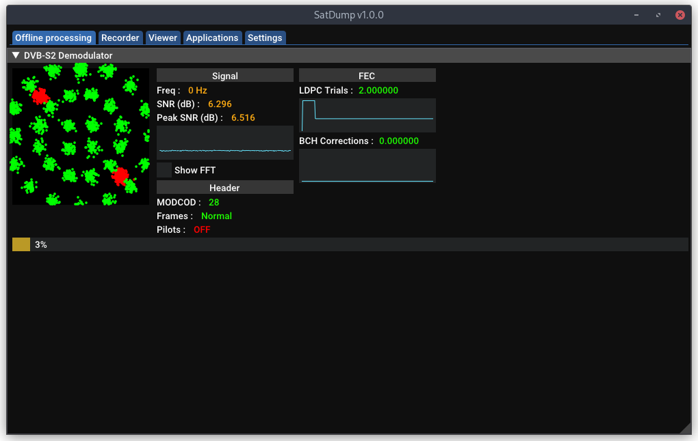
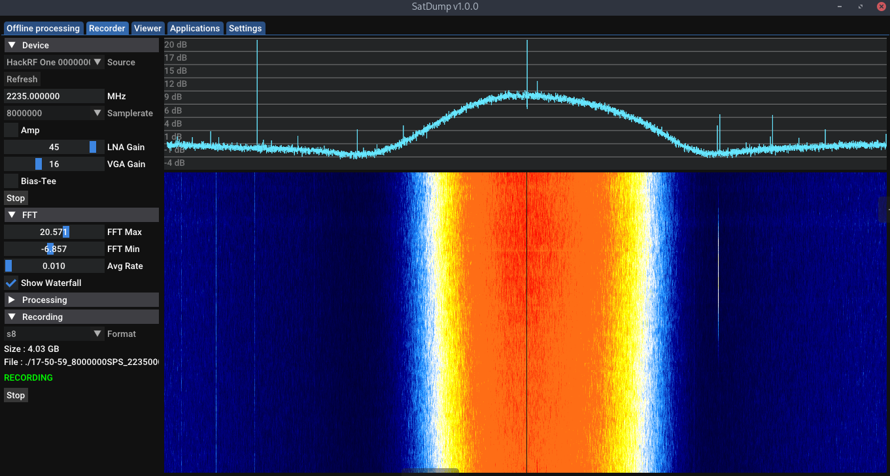

# SatDump


A generic satellite data processing software.
*Thanks Crosswalkersam for the icon!*

There now also is a [Matrix](https://matrix.to/#/#satdump:altillimity.com) room if you want to chat!

# Introduction

*Note : This is a very basic "how-to" skipping details and assuming some knowledge of what you are doing. For more details and advanced use cases, please see the [detailed documentation](https://docs.satdump.org).* 

## GUI Version

### Offline processing (recorded data)
Quick-Start :
- Choose the appropriate pipeline for what you want to process
- Select the input file (baseband, frames, soft symbols...)
- Set the appropriate input level (what your file is)
- Check settings shown below are right (such as samplerate)
- Press "Start"!



  
*SatDump demodulating a DVB-S2 Baseband*

### Live processing or recording (directly from your SDR)

Quick-Start :
- Go in the "Recorder" Tab
- Select and start your SDR Device
- Choose a pipeline
- Start it, and done!
- For recording, use the recording tab instead. Both processing and recording can be used at once.

  

## CLI Version

  

### Offline processing

```
Usage : satdump [pipeline_id] [input_level] [input_file] [output_file_or_directory] [additional options as required]
Extra options (examples. Any parameter used in modules can be used here) :
  --samplerate [baseband_samplerate] --baseband_format [f32/s16/s8/u8] --dc_block --iq_swap
Sample command :
satdump metop_ahrpt baseband /home/user/metop_baseband.s16 metop_output_directory --samplerate 6e6 --baseband_format s16
```

You can find a list of Satellite pipelines and their parameters [Here](docs/Satellite-pipelines.md).

### Live processing

```
Usage : satdump live [pipeline_id] [output_file_or_directory] [additional options as required]
Extra options (examples. Any parameter used in modules or sources can be used here) :
  --samplerate [baseband_samplerate] --baseband_format [f32/i16/i8/w8] --dc_block --iq_swap
  --source [airspy/rtlsdr/etc] --gain 20 --bias
As well as --timeout in seconds
Sample command :
satdump live metop_ahrpt metop_output_directory --source airspy --samplerate 6e6 --frequency 1701.3e6 --general_gain 18 --bias --timeout 780
```

You can find a list of all SDR Options [Here](docs/SDR-Options.md). Run `satdump sdr_probe` to get a list of available SDRs and their IDs.

### Recording

```
Usage : satdump record [output_baseband (without extension!)] [additional options as required]
Extra options (examples. Any parameter used in sources can be used here) :
  --samplerate [baseband_samplerate] --baseband_format [f32/s16/s8/u8/w16] --dc_block --iq_swap
  --source [airspy/rtlsdr/etc] --gain 20 --bias
As well as --timeout in seconds
Sample command :
satdump record baseband_name --source airspy --samplerate 6e6 --frequency 1701.3e6 --general_gain 18 --bias --timeout 780
```

# Building / Installing

### Windows
The fastest way to get started is to head over to the [Releases](https://github.com/altillimity/SatDump/releases) page, where you can download SatDump's installer or portable app - no compilation necessary.

Our builds are made with Visual Studio 2019 for x64, so the appropriate Visual C++ Runtime will be required (though, likely to be already installed). You can get it [here](https://support.microsoft.com/en-us/topic/the-latest-supported-visual-c-downloads-2647da03-1eea-4433-9aff-95f26a218cc0).   Once downloaded, run either satdump-ui.exe or satdump.exe (CLI) to get started!

For compilation information, see the dedicated documentation [here](/docs/Building-Windows.md). *Note : Mingw builds are NOT supported, VOLK will not work.*

### macOS
Dependency-free Intel (x64) macOS builds are provided on the [releases page](https://github.com/altillimity/SatDump/releases) (Thanks to JVital2013, the builds are also signed!).

While those will work for Apple Silicon (M1/M2) Macs, it is NOT recommended as performance will suffer greatly compared to natively-compiled builds. Pre-compiled ARM/Universal builds are planned.

General build instructions (Brew and XCode command line tools required)

```bash
# Install dependencies
brew install cmake volk jpeg libpng glfw airspy rtl-sdr hackrf nng pkg-config libomp dylibbundler portaudio

# Build and install libfftw3 to work around issue with brew version
wget http://www.fftw.org/fftw-3.3.9.tar.gz
tar xf fftw-3.3.9.tar.gz
rm fftw-3.3.9.tar.gz
cd fftw-3.3.9
mkdir build && cd build
cmake -DCMAKE_BUILD_TYPE=Release -DBUILD_TESTS=false -DENABLE_FLOAT=true -DENABLE_THREADS=true -DENABLE_SSE=true -DENABLE_SSE2=true -DENABLE_AVX=true -DENABLE_AVX2=true ..
make
sudo make install
cd ../..

# Build and install airspyhf
git clone https://github.com/airspy/airspyhf.git
cd airspyhf
mkdir build && cd build
cmake -DCMAKE_BUILD_TYPE=Release ..
make -j4
sudo make install
cd ../..

# Finally, SatDump
git clone https://github.com/altillimity/satdump.git
cd satdump
mkdir build && cd build
# If you do not want to build the GUI Version, add -DBUILD_GUI=OFF to the command
# If you want to disable some SDRs, you can add -DPLUGIN_HACKRF_SDR_SUPPORT=OFF or similar
cmake -DCMAKE_BUILD_TYPE=Release ..
make -j`nproc`

# To run without installing
ln -s ../pipelines .        # Symlink pipelines so it can run
ln -s ../resources .        # Symlink resources so it can run
ln -s ../satdump_cfg.json . # Symlink settings so it can run

# To install system-wide
sudo make install

# Make an app bundle (to add to your /Applications folder)
../macOS/bundle.sh
```

### Linux

On Linux, building from source is recommended, but builds are provided for x64-based Ubuntu distributions. Here are some generic (Debian-oriented) build instructions.

```bash
# Install dependencies on Debian-based systems:
sudo apt install git build-essential cmake g++ pkgconf libfftw3-dev libvolk2-dev libpng-dev                   # Core dependencies. If libvolk2-dev is not available, use libvolk1-dev
sudo apt install libnng-dev                                                                                   # If this package is not found, follow build instructions below for NNG
sudo apt install librtlsdr-dev libhackrf-dev libairspy-dev libairspyhf-dev                                    # All libraries required for live processing (optional)
sudo apt install libglfw3-dev                                                                                 # Only if you want to build the GUI Version (optional)
sudo apt install libzstd-dev                                                                                  # Only if you want to build with ZIQ Recording compression 
(optional)
sudo apt install libomp-dev                                                                                   # Shouldn't be required in general, but in case you have errors with OMP
sudo apt install ocl-icd-opencl-dev                                                                           # Optional, but recommended as it drastically increases speed of some operations. Installs OpenCL.
sudo apt install intel-opencl-icd                                                                             # Optional, enables OpenCL for Intel Integrated Graphics

# Install dependencies on Red-Hat-based systems:
sudo dnf install git cmake g++ fftw-devel volk-devel libpng-devel
sudo dnf install nng-devel
sudo dnf install rtl-sdr-devel hackrf-devel airspyone_host-devel
sudo dnf install glfw-devel
sudo dnf install libzstd-devel
(optional)
sudo dnf install libomp-devel
sudo dnf install ocl-icd                                                                                      # Optional, but recommended as it drastically increases speed of some operations. Installs OpenCL.
sudo dnf install intel-opencl                                                                                 # Optional, enables OpenCL for Intel Integrated Graphics

# Install dependencies on Alpine-based systems:
sudo apk add git cmake make g++ pkgconf fftw-dev libvolk-dev libpng-dev                                       # Adding the testing repository is required for libvolk-dev
# You need to build libnng from source, see below.
sudo apk add librtlsdr-dev hackrf-dev airspyone-host-dev airspyhf-dev
sudo apk add glfw-dev
sudo apk add zstd-dev
(optional)
sudo apk add opencl-dev                                                                                      # Optional, but recommended as it drastically increases speed of some operations. Installs OpenCL. Community repo required.

# If libnng-dev is not available, you will have to build it from source
git clone https://github.com/nanomsg/nng.git
cd nng
mkdir build && cd build
cmake -DCMAKE_BUILD_TYPE=Release -DBUILD_SHARED_LIBS=ON -DCMAKE_INSTALL_PREFIX=/usr ..
make -j4
sudo make install
cd ../..
rm -rf nng

# Finally, SatDump
git clone https://github.com/altillimity/satdump.git
cd satdump
mkdir build && cd build
# If you do not want to build the GUI Version, add -DBUILD_GUI=OFF to the command
# If you want to disable some SDRs, you can add -DPLUGIN_HACKRF_SDR_SUPPORT=OFF or similar
cmake -DCMAKE_BUILD_TYPE=Release -DCMAKE_INSTALL_PREFIX=/usr ..
make -j`nproc`

# To run without installing
ln -s ../pipelines .        # Symlink pipelines so it can run
ln -s ../resources .        # Symlink resources so it can run
ln -s ../satdump_cfg.json . # Symlink settings so it can run

# To install system-wide
sudo make install

# Run (if you want!)
./satdump-ui
```

### Android

On Android, the preferred source is F-Droid - [https://f-droid.org/en/packages/org.satdump.SatDump/](https://f-droid.org/en/packages/org.satdump.SatDump/).   

If this is not an option for you, APKs are also available on the [Release](https://github.com/altillimity/SatDump/releases) page.  

Do keep in mind that while pretty much all features perfectly function on Android, there may be some limitations (either due to the hardware) in some places. For example, not all SDR Devices can be used.  
Supported SDR devices are :
- RTL-SDR
- Airspy
- AirspyHF
- LimeSDR Mini
- HackRF
